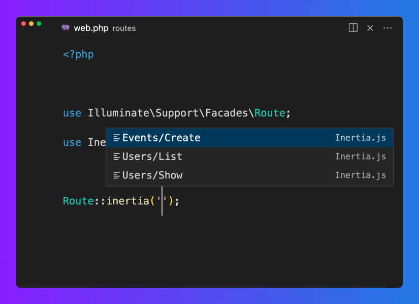

# Visual Studio Code extension for Inertia.js

This extension brings Inertia.js support to Visual Studio Code.

## Features

|                   Hyperlinks                    |                    Autocompletion                    |
| :---------------------------------------------: | :--------------------------------------------------: |
|  |  |
|       Adds hyperlinks to component names        |     Provides autocompletion for component names      |

## Configuration

Set the `inertia.pages` setting to a glob pattern that matches the components
that should appear in the autocompletion dialog. The extension also uses this
glob pattern to determine the root folder of your components.

For example, if your page components live under `resources/js/Pages`, you may
want to use the following glob pattern:

```
resources/js/Pages/**/*.vue
```

# License

This VS Code extension is open source software released under the
[MIT License](./LICENSE.md).
