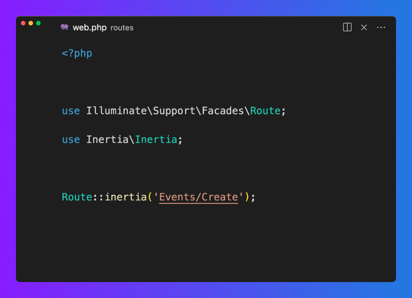

# Visual Studio Code extension for Inertia.js

[](https://marketplace.visualstudio.com/items?itemName=nhedger.inertia)
[](https://open-vsx.org/extension/nhedger/inertia)

This extension brings Inertia.js support to Visual Studio Code.

## Features

|                   Hyperlinks                    |                    Autocompletion                    |
| :---------------------------------------------: | :--------------------------------------------------: |
|  |  |
|       Adds hyperlinks to component names        |     Provides autocompletion for component names      |

## Configuration

### `inertia.pages`

The `inertia.pages` setting must be a glob pattern that matches the components
that should appear in the auto-completion dialog. This pattern is resolved
relative to your workspace's root folder.

The extension also uses this pattern to determine the root folder of your
components, which in turn is used to generate the hyperlinks to your page
components.

Here a some common patterns for different project types:

| Project type    | Pattern                       |
| --------------- | ----------------------------- |
| Laravel + Vue   | `resources/js/Pages/**/*.vue` |
| Laravel + React | `resources/js/Pages/**/*.tsx` |

### `inertia.pathSeparators`

Inertia.js commonly uses a forward slash when it comes to component names
because it naturally follows the filesystem structure, but while the components
will eventually have to be resolved to a filesystem path, nothing prevents you
from using different path separators inside the inertia methods.

#### Component resolution

This setting allows you to define a list of path separators that the extension
should handle when resolving components paths on click, and during
autocompletion. This setting only affects how the extension, and you will have
to change the way component resolution works in your Inertia.js application in
order to replaces those characters by a forward slash `/`.

Here's an example snippet that handles components paths written with
dot-notation.

```js
import { createApp, h } from 'vue';
import { createInertiaApp } from '@inertiajs/vue3';

createInertiaApp({
    resolve: (name) => {
        const pages = import.meta.glob('./Pages/**/*.vue', { eager: true });
        return pages[`./Pages/${name.replaceAll('.', '/')}.vue`];
    },
    setup({ el, App, props, plugin }) {
        createApp({ render: () => h(App, props) })
            .use(plugin)
            .mount(el);
    },
});
```

#### Autocompletion

During autocompletion, the first separator will be used when rendering the list
of components, so you should put your preferred path separator first.

### `inertia.defaultExtension`

When the extension generates hyperlinks to components that do not yet exist on
the filesystem, it cannot guess which file extension to use because the glob
pattern declared in `inertia.pages` may contain multiple file extensions. The
extension uses this setting to creates hyperlinks with the correct file
extension.

| Project type | Pattern |
| ------------ | ------- |
| Vue          | `.vue`  |
| React        | `.tsx`  |

# License

This VS Code extension is open source software released under the
[MIT License](./LICENSE.md).
